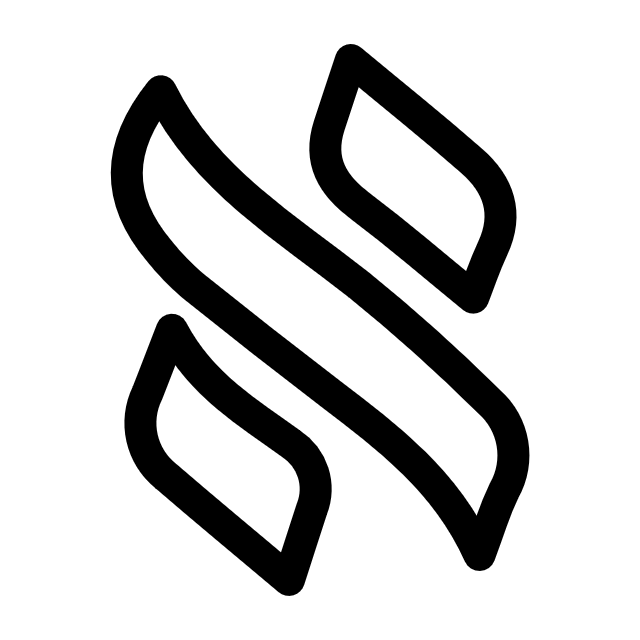

<div align="center">

# 🚀 RyanWez Portfolio

<p align="center">
  
</p>

<p align="center">
  <strong>AI Product Architect | Full Stack Developer</strong>
</p>

<p align="center">
  <a href="https://ryanwez.com">
    
  </a>
</p>

<p align="center">
  
  
  
  
  
</p>

<p align="center">
  <a href="https://t.me/RyanWez"></a>
  <a href="https://github.com/RyanWez"></a>
</p>

---

### 📊 PageSpeed Insights

<table align="center">
  <tr>
    <td align="center"><strong>🟢 Performance</strong></td>
    <td align="center"><strong>🟢 Accessibility</strong></td>
    <td align="center"><strong>🟢 Best Practices</strong></td>
    <td align="center"><strong>🟢 SEO</strong></td>
  </tr>
  <tr>
    <td align="center">96 - 99</td>
    <td align="center">95 - 100</td>
    <td align="center">100</td>
    <td align="center">100</td>
  </tr>
</table>

</div>

---

## ✨ Features

- 🎨 **Modern Dark UI** - Glassmorphism, gradient mesh blobs, and smooth animations
- 📱 **Fully Responsive** - Optimized for all screen sizes (375px - 4K)
- ⚡ **High Performance** - 96+ PageSpeed score with lazy loading and image optimization
- 🔍 **SEO Optimized** - JSON-LD structured data, Open Graph, Twitter Cards, Sitemap
- ♿ **Accessible** - WCAG compliant with reduced motion support
- 🚀 **Next.js 16** - App Router with static site generation

---

## 🛠️ Tech Stack

| Category | Technologies |
|----------|--------------|
| **Framework** | Next.js 16.1 (App Router) |
| **Frontend** | React 19, TypeScript 5 |
| **Styling** | TailwindCSS 4, CSS Variables |
| **Animations** | Framer Motion 12 |
| **Icons** | Lucide React, React Icons |
| **Deployment** | Vercel |

---

## 🚀 Quick Start

```bash
# Clone the repository
git clone https://github.com/RyanWez/rw-portfolio.git

# Navigate to directory
cd rw-portfolio

# Install dependencies
npm install

# Run development server
npm run dev

# Build for production
npm run build
```

Open [http://localhost:3000](http://localhost:3000) to view the portfolio.

---

## 📁 Project Structure

```
rw-portfolio/
├── app/
│   ├── layout.tsx      # Root layout with SEO metadata
│   ├── page.tsx        # Home page with lazy-loaded sections
│   ├── sitemap.ts      # Dynamic sitemap generation
│   ├── robots.ts       # Robots.txt configuration
│   └── globals.css     # Global styles & utilities
├── components/
│   ├── hero.tsx        # Hero section with animations
│   ├── navigation.tsx  # Floating pill navigation
│   ├── projects-carousel.tsx  # Bento grid projects
│   ├── philosophy.tsx  # Philosophy cards
│   ├── contact.tsx     # Contact section
│   └── ui/             # Reusable UI components
└── public/
    └── images/         # Static images
```

---

## 📄 License

MIT © [RyanWez](https://github.com/RyanWez)

---

<div align="center">

**Built with ❤️ and AI**

</div>
